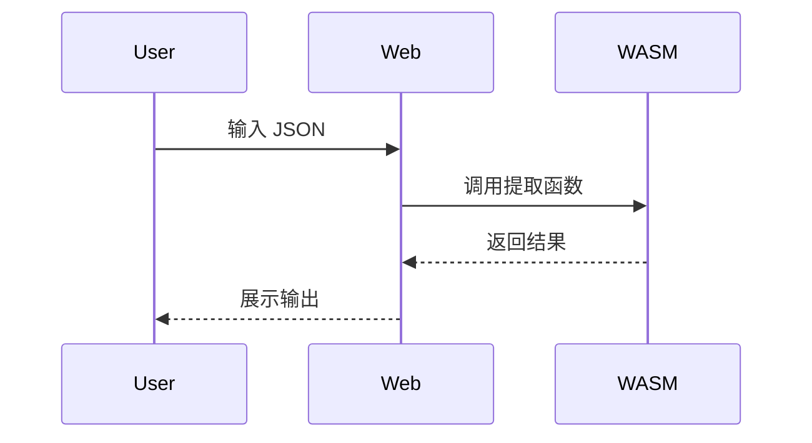

# ShardDen (砾穴) - AGENTS.md

**Generated:** 2026-02-15  
**Project:** ShardDen - Modular Developer Toolkit Platform  
**Stack:** Rust + Next.js + Tauri + WASM

---

## OVERVIEW

ShardDen is a modular toolkit platform. CLI-first tools with shared Rust core, exposed via WASM to Web (stateless) and Desktop (Tauri + storage).

---

## STRUCTURE

```
shard-den/
├── Cargo.toml              # Rust workspace root
├── package.json            # Node workspace root
│
├── packages/
│   ├── core/               # Shared Rust core (config, error, history traits)
│   ├── wasm/               # WASM bindings (re-exports ALL tools)
│   ├── tools/
│   │   └── json-extractor/ # Tool: JSON extraction
│   │       ├── src/        # Core lib (wasm-bindgen exports)
│   │       └── cli/        # CLI binary
│   ├── web/                # Next.js frontend
│   └── desktop/            # Tauri desktop app
│
├── docs/
│   └── plans/              # Architecture design docs
│
└── README.md
```

---

## WHERE TO LOOK

| Task | Location | Notes |
|------|----------|-------|
| Add new tool | `packages/tools/{tool-name}/` | See json-extractor as template |
| Shared logic | `packages/core/src/` | Config, errors, history trait |
| Web UI | `packages/web/src/app/tools/` | One page per tool |
| Desktop native | `packages/desktop/src/` | Tauri commands, storage |
| WASM exports | `packages/wasm/src/lib.rs` | Re-exports all tool functions |
| CLI binary | `packages/tools/{tool}/cli/main.rs` | Per-tool CLI entry |

---

## CONVENTIONS

### Rust

**Naming:**
- `snake_case` for files, functions, variables
- `PascalCase` for types, traits, enums
- `SCREAMING_SNAKE_CASE` for constants

**Structure:**
- One module per file
- `lib.rs` exports public API
- `error.rs` defines error types
- Separate `cli/` for binary entry points

**WASM Exports:**
```rust
use wasm_bindgen::prelude::*;

#[wasm_bindgen]
pub struct ToolName { }

#[wasm_bindgen]
impl ToolName {
    #[wasm_bindgen(constructor)]
    pub fn new() -> Self { }
    
    pub fn execute(&self, input: &str) -> Result<String, JsValue> { }
}
```

### TypeScript/React

**Structure:**
- `page.tsx` - Route pages
- `components/ui/` - Shared UI components
- `components/tools/{tool}/` - Tool-specific components
- `lib/core.ts` - WASM bindings

**WASM Import:**
```typescript
import * as ShardDen from 'shard-den-wasm';
```

---

## DESIGN REQUIREMENTS

### UI Design (原型图设计)

**所有 UI 功能必须包含原型图设计文档:**

```
docs/designs/

├── json-extractor/
│   │   ├── ui/
│   │   │   ├── prototype.md      # 原型图描述（文字+ASCII/截图）
└── [new-tool]/
│       └── ...
```

**原型图必须包含:**
- 页面布局说明（桌面端/移动端响应式）
- 核心组件位置标注
- 用户交互流程（点击、输入、反馈）
- 错误状态和边界情况

**工具推荐:** Figma、Excalidraw、ASCII 艺术（简单页面）

### Functional Design (功能流程设计)

**所有功能必须包含设计文档:**

```
docs/designs/
├── json-extractor/
│   │   ├── flows/
│   │   │   ├── flow.md           # 功能流程说明
│   │   │   ├── sequence.mmd      # 时序图 (Mermaid)
│   │   │   ├── state.md          # 状态机说明
│   [new-tool]/
│   └── ...
```

**流程图必须包含:**
- 用户操作流程（Flow Chart）
- 组件间交互时序（Sequence Diagram）
- 错误处理路径
- 异步操作状态流转

**格式:** 使用 Mermaid 语法存储在 `.mmd` 文件中



## TEST COVERAGE (测试覆盖率)

### Coverage Requirements

| 模块 | 最低覆盖率 | 工具 |
|------|-----------|------|
| Rust Core | **≥ 85%** | `cargo tarpaulin` |
| Rust Tools | **≥ 85%** | `cargo tarpaulin` |
| TypeScript/Web | **≥ 85%** | `vitest` / `jest` |

### Coverage Check Commands

```bash
# Rust 覆盖率检查
cargo tarpaulin --packages shard-den-core --packages shard-den-json-extractor --fail-under 85

# Web 覆盖率检查
cd packages/web
npm run test:coverage -- --threshold=85
```

### Required Test Types

**Rust:**
- Unit tests (`#[cfg(test)]` 模块)
- Integration tests (`tests/` 目录)
- WASM bindings tests（使用 `wasm-bindgen-test`）

**TypeScript:**
- Component tests (React Testing Library)
- Hook tests
- E2E tests (Playwright - 关键流程)

### CI Enforcement

覆盖率检查必须在 CI 中强制执行，低于 85% 的 PR 无法合并。

## ANTI-PATTERNS

**NEVER:**
- Store data in Web (stateless only)
- Use `any` type in TypeScript
- Skip wasm-bindgen for tool exports
- Put CLI logic in web components
- Bypass Core for tool logic
- **Start coding without design docs** (原型图/流程图)
- **Skip tests to meet deadlines**
- **Commit without coverage check**

**ALWAYS:**
- Start with CLI, then WASM, then UI
- Re-export tools through `packages/wasm/`
- Use Core types for cross-platform consistency
- Test WASM in browser before integrating UI
- **Design first, code second** (原型图 → 流程图 → 实现)
- **Write tests alongside implementation**
- **Maintain coverage ≥ 85%**

---

## COMMANDS

```bash
# Rust
cargo build --release -p shard-den           # Build CLI
cargo build --release -p shard-den-wasm     # Build WASM

# Web
cd packages/web
npm install
npm run dev                                 # Dev server
npm run build                               # Production build

# Desktop
cd packages/desktop
cargo tauri dev                             # Dev mode
cargo tauri build                           # Build app

# Full build
./scripts/build-all.sh                      # Build all targets
```

---

## ARCHITECTURE NOTES

**Web = Stateless:** No storage, no backend. Pure WASM in browser.  
**Desktop = Full:** WASM + Tauri commands + local JSON storage.  
**CLI = Core:** Native Rust, no WASM overhead.

**Tool Pattern:**
1. Core lib in `src/` with wasm-bindgen exports
2. CLI binary in `cli/main.rs`
3. Re-export in `packages/wasm/`
4. Web page in `packages/web/src/app/tools/{tool}/`

---

## REFERENCE

- [Architecture Design](./docs/plans/2026-02-15-shard-den-architecture-design.md)
- [Tauri Docs](https://tauri.app/)
- [wasm-bindgen Guide](https://rustwasm.github.io/wasm-bindgen/)
- [Next.js App Router](https://nextjs.org/docs/app)
