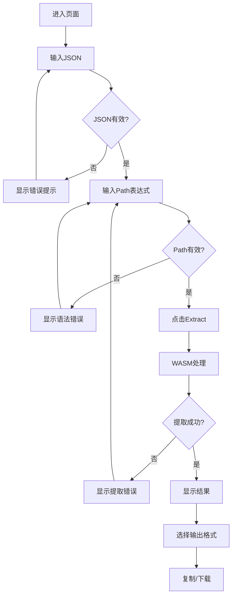
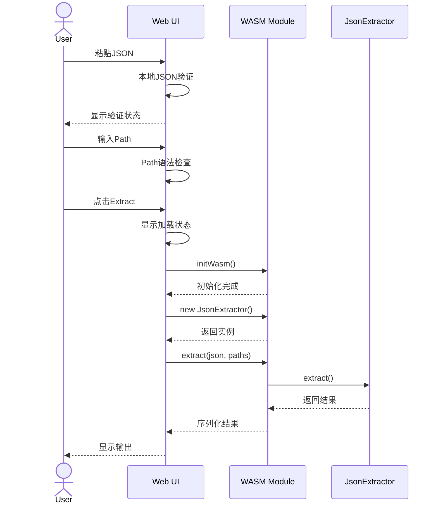
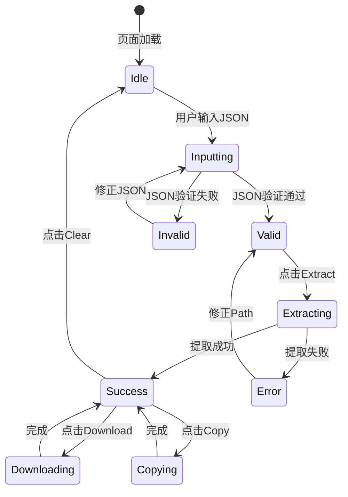

# JSON Extractor - 功能流程设计

## 用户操作流程



## 组件交互时序



## 状态机



## 错误处理路径

| 错误类型 | 触发条件 | 用户反馈 | 恢复操作 |
|----------|----------|----------|----------|
| JSON语法错误 | 输入无效JSON | 红色边框 + 底部提示 | 修正JSON |
| Path语法错误 | 路径表达式无效 | 路径框红色 + 建议 | 修正Path |
| 路径不存在 | Path不匹配任何字段 | Toast通知 | 使用自动检测 |
| 提取异常 | WASM内部错误 | 错误详情弹窗 | 重试 |
| 空结果 | 路径存在但值为null | 黄色提示 | 检查JSON结构 |

## 异步操作状态

### WASM初始化
```
状态: idle -> loading -> ready | error
- idle: 未初始化
- loading: 正在加载WASM文件
- ready: 可以调用工具方法
- error: 加载失败，显示重试按钮
```

### 提取操作
```
状态: idle -> validating -> extracting -> success | error
- idle: 等待输入
- validating: 本地验证JSON和Path
- extracting: WASM执行提取（可取消）
- success: 显示结果
- error: 显示错误信息
```

## 性能考虑

1. **防抖处理**: JSON输入防抖500ms后验证
2. **节流处理**: Path输入建议节流300ms
3. **懒加载**: WASM模块首次使用时加载
4. **缓存**: 相同输入结果缓存（LRU，最大10条）
5. **虚拟滚动**: 结果数组过大时使用虚拟滚动

## 边界情况

1. **超大JSON**: >10MB时提示警告，>50MB时拒绝处理
2. **深层嵌套**: 超过20层时显示警告
3. **特殊字符**: 支持Unicode和emoji的JSON
4. **空输入**: 禁用Extract按钮
5. **浏览器刷新**: 保留输入内容（sessionStorage）
