# UML Styler - 功能流程设计

> **Date:** 2026-02-28
> **Status:** Draft

---

## 1. 核心流程图

### 1.1 编辑-渲染-导出主流程

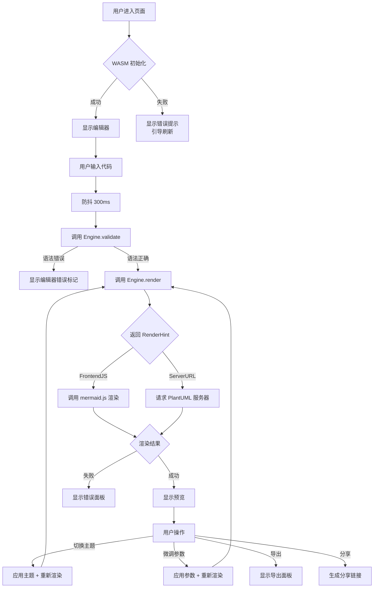

### 1.2 URL 分享流程

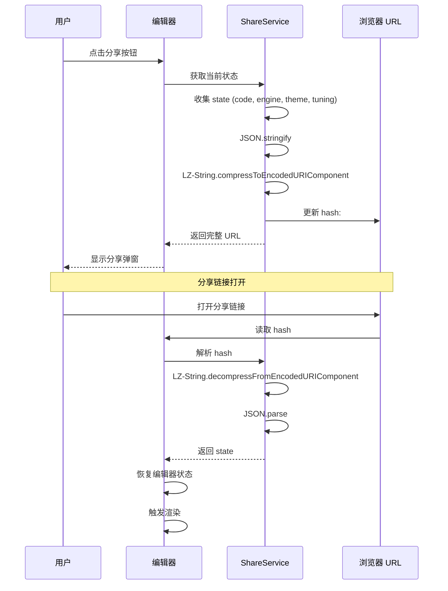

---

## 2. 状态管理流程

### 2.1 状态结构

```typescript
interface UmlStylerState {
  // === 核心状态 ===
  code: string;                    // 图表代码
  engine: 'mermaid' | 'plantuml';  // 当前引擎
  
  // === 主题状态 ===
  theme: string;                   // 主题 ID
  themeTuning: ThemeTuning;        // 全局微调参数
  
  // === 预览状态 ===
  previewSvg: string | null;       // 渲染结果 SVG
  previewError: Diagnostic | null; // 渲染错误
  isRendering: boolean;            // 渲染中标记
  viewport: Viewport;              // 视口位置
  
  // === 导出状态 ===
  exportFormat: ExportFormat;      // 导出格式
  resolution: Resolution;          // 分辨率设置
  
  // === UI 状态 ===
  isWasmReady: boolean;            // WASM 就绪标记
  wasmError: string | null;        // WASM 错误
  showThemePanel: boolean;         // 主题面板展开
  showExportPanel: boolean;        // 导出面板展开
  showTemplatePanel: boolean;      // 模板面板展开
}

interface ThemeTuning {
  primaryColor: string;
  backgroundColor: string;
  fontFamily: string;
  fontSize: number;
  lineWidth: number;
  textColor: string;
}

interface Viewport {
  x: number;
  y: number;
  zoom: number;
}

type ExportFormat = 'png' | 'svg' | 'pdf';

type Resolution = 
  | { type: 'preset'; scale: 1 | 2 | 3 | 4 }
  | { type: 'dpi'; value: number }
  | { type: 'custom'; width: number; height: number };

interface Diagnostic {
  line: number;
  column: number;
  message: string;
  severity: 'error' | 'warning' | 'info';
}
```

### 2.2 状态更新流程

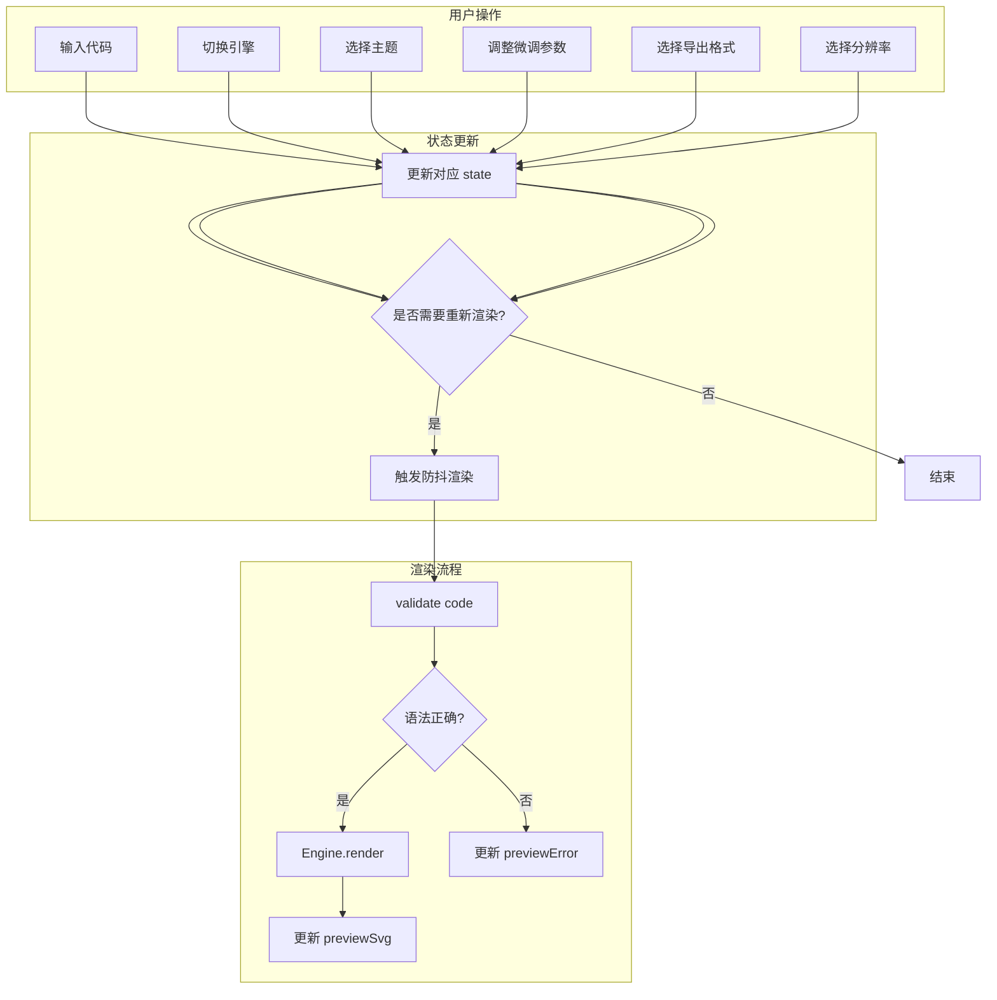

---

## 3. 错误处理流程

### 3.1 错误分类与处理

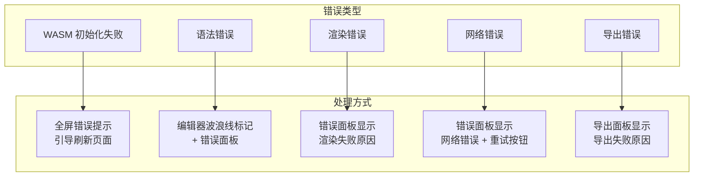

### 3.2 PlantUML 服务器错误处理

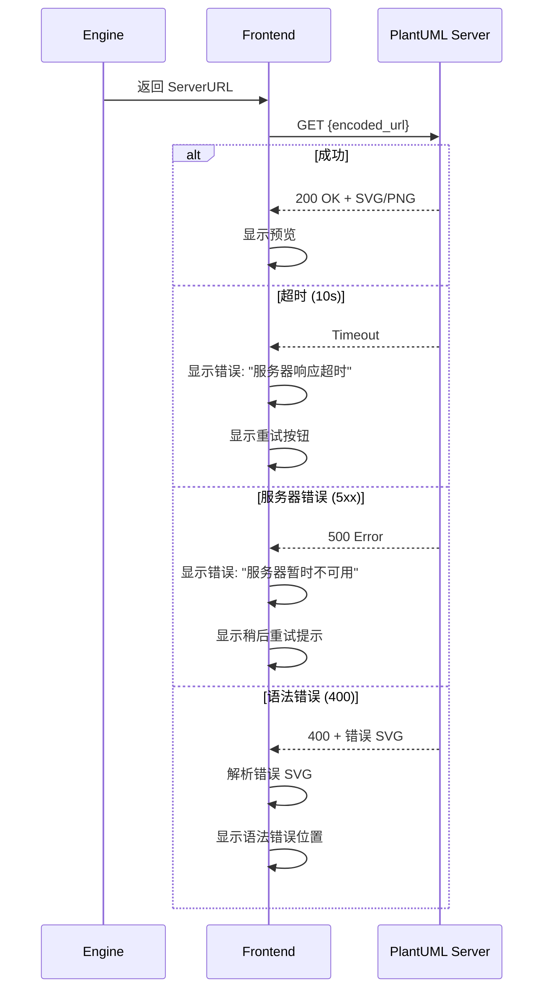

### 3.3 重试策略

| 错误类型 | 重试次数 | 重试间隔 | 降级策略 |
|----------|---------|---------|---------|
| 网络超时 | 3 次 | 指数退避 (1s, 2s, 4s) | 显示错误，用户手动重试 |
| 服务器 5xx | 2 次 | 固定 2s | 引导稍后重试 |
| 语法错误 | 不重试 | - | 显示错误位置 |

---

## 4. 性能优化流程

### 4.1 渲染防抖

```typescript
// 防抖渲染 Hook
function useDebouncedRender(delay = 300) {
  const timerRef = useRef<NodeJS.Timeout>();
  
  const scheduleRender = useCallback((code: string) => {
    if (timerRef.current) {
      clearTimeout(timerRef.current);
    }
    
    timerRef.current = setTimeout(() => {
      renderDiagram(code);
    }, delay);
  }, [delay]);
  
  return scheduleRender;
}
```

### 4.2 大图渲染优化

```mermaid
flowchart TD
    A[开始渲染] --> B{图表节点数 > 100?}
    
    B -->|是| C[显示渲染中提示]
    C --> D[Web Worker 渲染]
    D --> E{渲染成功?}
    
    B -->|否| F[主线程渲染]
    F --> E
    
    E -->|成功| G[显示预览]
    E -->|超时 (>5s)| H[显示简化版预览]
    H --> I[提示: 图表较大，已简化显示]
```

### 4.3 模板库虚拟滚动

```typescript
// 虚拟滚动实现
interface VirtualScrollConfig {
  itemHeight: 150;      // 每个卡片高度
  visibleCount: 6;      // 可见数量
  bufferCount: 3;       // 缓冲数量
}

// 只渲染可见区域 + 缓冲区域的模板卡片
function renderVisibleTemplates(scrollTop: number) {
  const startIndex = Math.floor(scrollTop / itemHeight) - bufferCount;
  const endIndex = startIndex + visibleCount + bufferCount * 2;
  
  return templates.slice(
    Math.max(0, startIndex),
    Math.min(templates.length, endIndex)
  );
}
```

---

## 5. 导出流程

### 5.1 PNG 导出

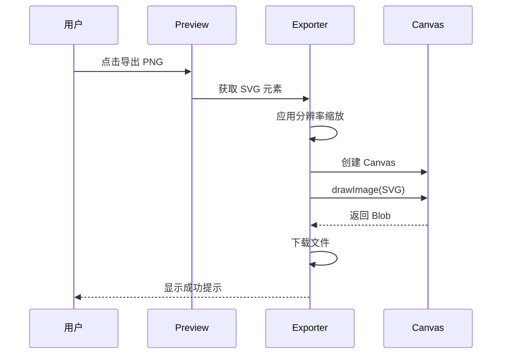

### 5.2 SVG 导出

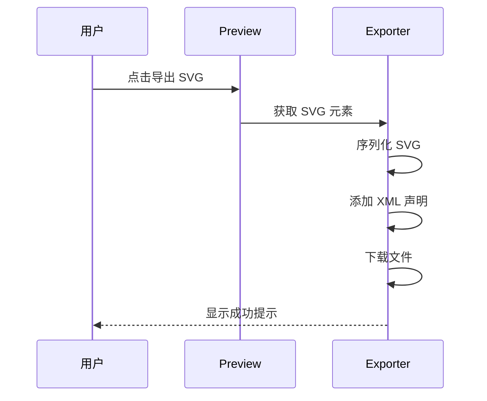

### 5.3 PDF 导出

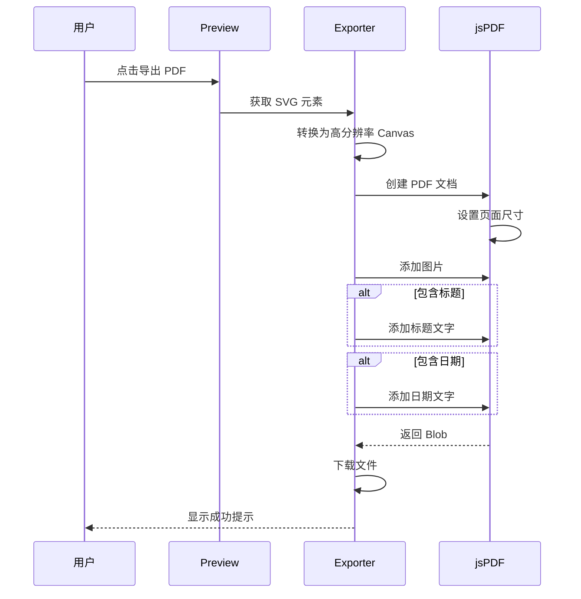

---

## 6. Desktop 存储流程

### 6.1 历史记录存储

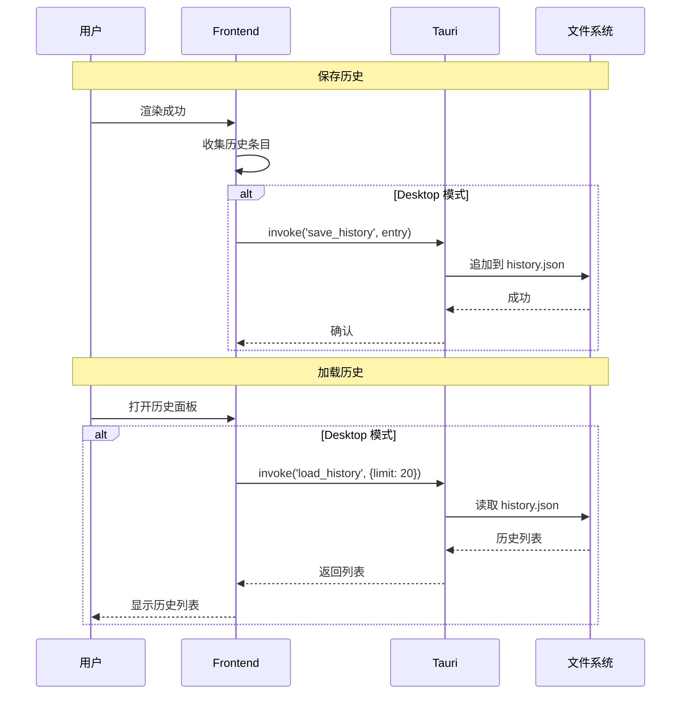

### 6.2 自定义模板存储

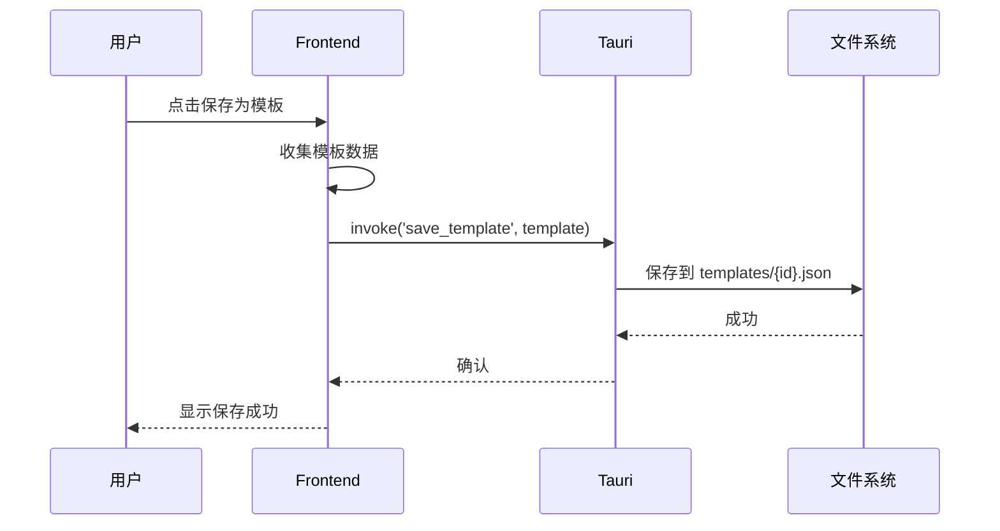

---

## 7. WASM 初始化流程

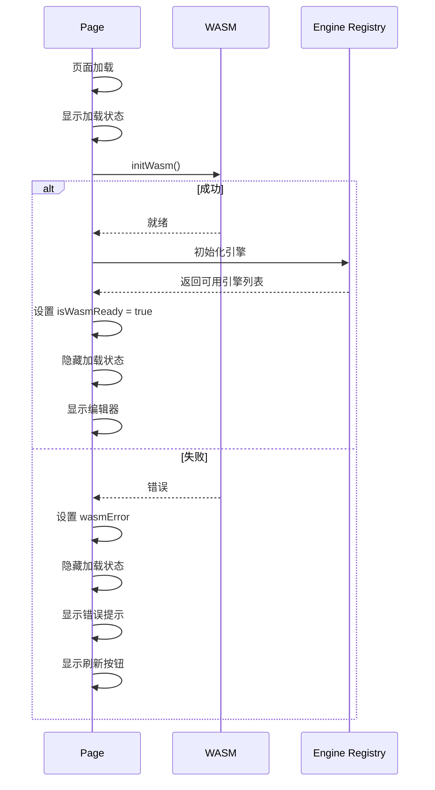

### 7.1 初始化状态管理

```typescript
type WasmStatus = 'idle' | 'loading' | 'ready' | 'error';

interface WasmState {
  status: WasmStatus;
  error: string | null;
  engines: string[];
}

// 初始化 Hook
function useWasmInit() {
  const [state, setState] = useState<WasmState>({
    status: 'idle',
    error: null,
    engines: [],
  });
  
  useEffect(() => {
    setState(s => ({ ...s, status: 'loading' }));
    
    initWasm()
      .then(() => {
        // 获取可用引擎
        const engines = getAvailableEngines();
        setState({ status: 'ready', error: null, engines });
      })
      .catch((err) => {
        setState({ 
          status: 'error', 
          error: err.message, 
          engines: [] 
        });
      });
  }, []);
  
  return state;
}
```

---

## 8. 测试关键路径

| # | 测试场景 | 预期结果 |
|---|----------|---------|
| 1 | 页面首次加载 | WASM 初始化成功，显示编辑器 |
| 2 | WASM 加载失败 | 显示错误提示和刷新按钮 |
| 3 | 输入有效 Mermaid 代码 | 预览区显示渲染结果 |
| 4 | 输入无效语法 | 编辑器显示错误波浪线，错误面板显示详情 |
| 5 | 切换主题 | 图表立即应用新主题 |
| 6 | 调整全局微调参数 | 图表实时更新 |
| 7 | 导出 PNG 2x | 下载双倍分辨率 PNG |
| 8 | 生成分享链接 | URL 更新，可复制分享 |
| 9 | 打开分享链接 | 恢复完整编辑器状态 |
| 10 | PlantUML 服务器超时 | 显示错误，提供重试按钮 |
| 11 | Desktop 保存历史 | 历史记录持久化到本地 |
| 12 | 移动端切换 Tab | 正确显示对应功能 |
## 8. 离线支持流程

### 8.1 离线状态检测

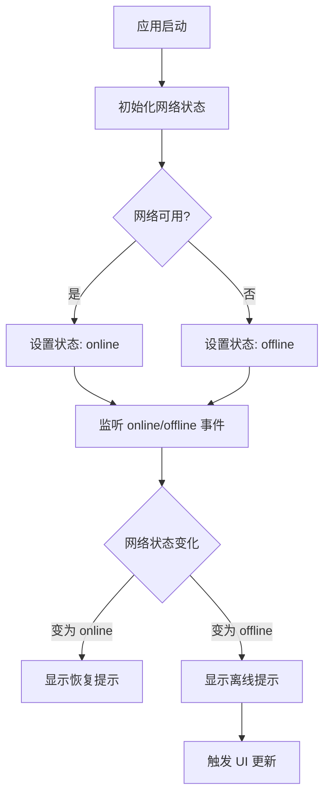

### 8.2 引擎离线支持

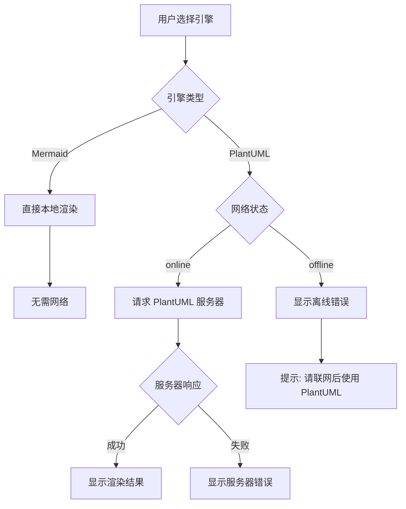

### 8.3 useNetwork Hook

```typescript
interface NetworkStatus {
  isOnline: boolean;
  wasOffline: boolean;  // 曾离线，用于显示恢复提示
}

// Hook 实现
function useNetwork(): NetworkStatus {
  const [isOnline, setIsOnline] = useState(
    typeof navigator !== 'undefined' ? navigator.onLine : true
  );
  const [wasOffline, setWasOffline] = useState(false);

  useEffect(() => {
    const handleOnline = () => {
      setIsOnline(true);
      setWasOffline(true);  // 标记曾离线
      setTimeout(() => setWasOffline(false), 5000);  // 5秒后清除
    };
    
    const handleOffline = () => {
      setIsOnline(false);
    };

    window.addEventListener('online', handleOnline);
    window.addEventListener('offline', handleOffline);

    return () => {
      window.removeEventListener('online', handleOnline);
      window.removeEventListener('offline', handleOffline);
    };
  }, []);

  return { isOnline, wasOffline };
}
```

### 8.4 离线状态 UI

```
┌──────────────────────────────────────────────────────────────────────────────┐
│  [Logo]  UML Styler                    [主题选择] [分享] [导出]  [主题切换] │
│  ⚠️ 离线模式 - Mermaid 可用，PlantUML 需要网络                             │
├──────────────────────────────────────────────────────────────────────────────┤
│                                                                              │
│  ┌─────────────────────────────┐  ┌─────────────────────────────────────┐   │
│  │                             │  │                                     │   │
│  │       代码编辑器            │  │          预览区域                   │   │
│  │                             │  │                                     │   │
│  └─────────────────────────────┘  └─────────────────────────────────────┘   │
│                                                                              │
└──────────────────────────────────────────────────────────────────────────────┘
```

**离线提示位置:** Header 下方，显示为黄色警告条

**离线提示内容:**
- 离线时: `⚠️ 离线模式 - Mermaid 可用，PlantUML 需要网络`
- 恢复在线时 (5秒): `✅ 网络已恢复`

### 8.5 Mermaid 离线验证

| 场景 | 预期行为 |
|------|---------|
| 完全离线 (无网络) | Mermaid 正常渲染，无需网络 |
| 首次加载 (有缓存) | Mermaid 从缓存加载，正常工作 |
| 首次加载 (无缓存) | 需要网络加载 Mermaid 库，之后可离线使用 |
| 离线后恢复网络 | 自动检测，无需刷新 |

**关键点:**
- Mermaid 是纯客户端库，一旦加载完成就不需要网络
- 只需在首次加载时联网，之后可完全离线使用
- PlantUML 需要连接到 PlantUML 服务器，无法离线工作

---

## 9. 测试关键路径

| # | 测试场景 | 预期结果 |
|---|----------|---------|
| 1 | 页面首次加载 | WASM 初始化成功，显示编辑器 |
| 2 | WASM 加载失败 | 显示错误提示和刷新按钮 |
| 3 | 输入有效 Mermaid 代码 | 预览区显示渲染结果 |
| 4 | 输入无效语法 | 编辑器显示错误波浪线，错误面板显示详情 |
| 5 | 切换主题 | 图表立即应用新主题 |
| 6 | 调整全局微调参数 | 图表实时更新 |
| 7 | 导出 PNG 2x | 下载双倍分辨率 PNG |
| 8 | 生成分享链接 | URL 更新，可复制分享 |
| 9 | 打开分享链接 | 恢复完整编辑器状态 |
| 10 | PlantUML 服务器超时 | 显示错误，提供重试按钮 |
| 11 | Desktop 保存历史 | 历史记录持久化到本地 |
| 12 | 移动端切换 Tab | 正确显示对应功能 |
| 13 | 离线状态打开页面 | 显示离线提示，Mermaid 正常渲染 |
| 14 | 离线选择 PlantUML 引擎 | 显示需要网络的错误提示 |
| 15 | 从离线恢复网络 | 显示恢复提示，PlantUML 恢复正常 |