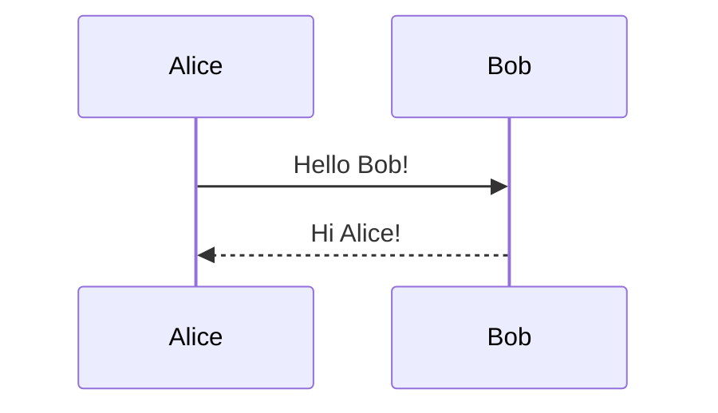
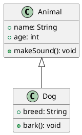

# ShardDen UML Styler - 设计文档

> **Date:** 2026-02-28
> **Project:** ShardDen UML Styler（砾穴UML范儿）
> **Status:** Design Approved (v2.0)

---

## 1. 项目概述

### 1.1 项目信息

| 维度 | 内容 |
|------|------|
| **项目名称** | ShardDen UML Styler（砾穴UML范儿） |
| **项目定位** | 一款支持多种图表语言的在线编辑器，主打"一键美化"和"灵活导出" |
| **核心价值** | 让开发者快速生成美观的架构图/流程图，无需手写繁琐的样式参数 |
| **所属项目** | ShardDen（砾穴）工具集 |
| **技术栈** | Rust Core + WASM + Next.js + Tauri |
| **架构原则** | CLI 弱化，前端为主，混合渲染架构 |

### 1.2 问题陈述

**现有解决方案的痛点：**

| 痛点 | 具体描述 |
|------|---------|
| **主题样式丑** | PlantUML/Mermaid 默认样式简陋，不够专业美观 |
| **调整样式繁琐** | 需要手写大量样式参数（颜色、字体、线条），效率低 |
| **导出受限** | 导出图片分辨率固定，放大后模糊，无法满足演示/打印需求 |
| **工具分散** | PlantUML 和 Mermaid 工具各自独立，用户需要在多个网站切换 |
| **无离线支持** | 大多数在线工具依赖网络，断网无法使用 |
| **分享困难** | 难以分享图表给他人，需要截图或导出发送 |

### 1.3 目标用户

| 用户类型 | 使用场景 | 核心诉求 |
|---------|---------|---------|
| **后端开发者** | 设计 API 时序图、服务架构图 | 快速生成、美观输出 |
| **前端开发者** | 组件流程图、状态机图 | 实时预览、便捷导出 |
| **架构师** | 系统架构图、部署图 | 专业外观、高清导出 |
| **技术文档作者** | 文档插图、流程说明 | 统一风格、批量生成 |
| **AI 应用开发者** | LLM 工作流图、Agent 架构图 | 快速迭代、美观呈现 |

---

## 2. 核心功能

### 2.1 编辑器

| 功能 | 描述 |
|------|------|
| **布局** | 左右分屏，左侧代码编辑，右侧实时预览 |
| **语法高亮** | 支持 PlantUML 和 Mermaid 语法高亮 |
| **自动补全** | 智能提示关键字和常用语法片段 |
| **模板库** | 内置基础模板，覆盖常见图表场景 |
| **URL 分享** | LZ-String 压缩，生成可分享链接 |

### 2.2 渲染引擎（混合架构）

| 引擎 | 渲染方式 | Rust/WASM 职责 | 前端职责 |
|------|---------|----------------|----------|
| **Mermaid Engine** | 本地渲染 (mermaid.js) | 返回 `FrontendJS` 标识 | 使用 mermaid.js 本地渲染 |
| **PlantUML Engine** | 公共服务器渲染 | 返回 `ServerURL` | 请求 PlantUML 服务器获取图片 |
| **Future Engines** | 待扩展 | 返回对应 RenderHint | 根据标识选择渲染方式 |

**RenderHint 设计（核心）：**

```rust
pub enum RenderHint {
    FrontendJS,                    // 前端 JS 渲染
    ServerURL(String),             // 服务器渲染 URL
    WasmReady(Vec<u8>),            // 未来：WASM 直接渲染
}

pub trait Engine {
    fn name(&self) -> &str;
    fn render(&self, code: &str, theme: &Theme) -> Result<RenderHint, EngineError>;
    fn validate(&self, code: &str) -> Result<Vec<Diagnostic>, EngineError>;
    fn get_themes(&self) -> Vec<Theme>;
    fn get_templates(&self) -> Vec<Template>;
}
```

**插件化原则：**
1. 实现 Engine Interface
2. 返回适当的 RenderHint
3. 前端自动识别渲染方式

### 2.3 主题系统

#### 2.3.1 主题分类

| 类型 | 说明 | 示例 |
|------|------|------|
| **共享主题** | 同一主题名同时应用到所有引擎，风格统一 | 默认、暗黑模式、商务蓝、手绘风 |
| **独立主题** | 各引擎专属主题，发挥各自特色 | PlantUML: Cerulean, Sketchy / Mermaid: forest, neutral |

#### 2.3.2 主题来源

- **复用官方主题**：PlantUML 官方主题 (Cerulean, Sketchy, Toy, Vibrant 等)、Mermaid 官方主题 (default, dark, forest, neutral 等)
- **扩展自定义主题**：基于官方主题扩展，或全新设计

#### 2.3.3 主题微调（全局）

| 参数 | 说明 | 影响范围 |
|------|------|---------|
| **主色调** | Primary color | 所有引擎的强调色 |
| **字体** | 字体族、字号 | 所有引擎的文字 |
| **线条粗细** | 边框线条宽度 | 所有引擎的边框 |
| **背景色** | 图表背景颜色 | 所有引擎的背景 |
| **文字颜色** | 标签、注释文字颜色 | 所有引擎的文字 |

**全局微调实现：**
- Mermaid：通过 `themeVariables` 配置注入
- PlantUML：转换为 PlantUML 样式参数（如 `skinParam`）

### 2.4 导出系统

#### 2.4.1 导出格式

| 格式 | 用途 |
|------|------|
| **PNG** | 通用格式，粘贴到文档/聊天 |
| **SVG** | 矢量图，可缩放，适合演示文稿 |
| **PDF** | 文档打印、高清输出 |
| **分享链接** | 生成 URL 分享图表（LZ-String 编码） |

#### 2.4.2 分辨率控制（差异化功能）

| 方式 | 说明 |
|------|------|
| **预设档位** | 1x / 2x / 3x / 4x，简单易用 |
| **自定义 DPI** | 输入具体 DPI 值（如 150, 300, 600），满足打印需求 |
| **自定义尺寸** | 输入具体宽高像素值，精确控制输出尺寸 |

### 2.5 错误处理

| 展示方式 | 描述 |
|----------|------|
| **编辑器标记** | Monaco 中高亮错误行，hover 显示错误详情 |
| **错误面板** | 预览区域显示错误信息，包含错误位置和描述 |

### 2.6 存储方案

| 版本 | 存储策略 | 说明 |
|------|---------|------|
| **Web 版** | 无存储 | 纯浏览器运行，数据不上传服务器，隐私友好；URL 分享替代持久化 |
| **Desktop 版** | 本地存储 | 支持历史记录、收藏模板、用户配置持久化、自定义主题保存 |

---

## 3. 差异化优势

| 对比维度 | 竞品现状 | ShardDen UML Styler |
|---------|---------|------------------------|
| **主题丰富度** | 2-5 个基础主题 | 20+ 丰富主题库 |
| **全局主题微调** | 不支持 | 支持主色/字体/线条微调，应用到所有引擎 |
| **导出分辨率** | 固定分辨率 | 预设 + DPI + 尺寸全支持 |
| **多引擎支持** | 单一引擎 | PlantUML + Mermaid + 未来扩展 |
| **URL 分享** | 部分支持 | LZ-String 压缩，完整状态分享 |
| **离线使用** | 不支持 | Desktop 版支持离线 |
| **隐私保护** | 代码上传服务器 | Web 版纯本地，Desktop 版数据本地存储 |
| **扩展性** | 单体应用 | 插件化 RenderHint 架构，支持混合渲染 |
| **错误定位** | 简单提示 | 编辑器标记 + 错误面板双重展示 |

---

## 4. 技术架构

### 4.1 整体架构

```
┌─────────────────────────────────────────────────────────────────────────┐
│                    ShardDen UML Styler                                  │
├─────────────────────────────────────────────────────────────────────────┤
│                                                                         │
│  ┌─────────────────────────────────────────────────────────────────┐   │
│  │                    Frontend (Next.js + React)                     │   │
│  │  ┌───────────────┐  ┌───────────────┐  ┌───────────────────┐   │   │
│  │  │    Editor     │  │    Preview    │  │    Theme Panel    │   │   │
│  │  │   Component   │  │   Component   │  │    Component      │   │   │
│  │  │               │  │               │  │                   │   │   │
│  │  │ • Monaco/     │  │ • SVG/Canvas  │  │ • Theme List      │   │   │
│  │  │   CodeMirror  │  │ • Error Panel │  │ • Theme Preview   │   │   │
│  │  │ • Syntax      │  │ • Zoom/Pan    │  │ • Fine-tune       │   │   │
│  │  │   Highlight   │  │               │  │   Controls        │   │   │
│  │  │ • Auto-       │  │               │  │                   │   │   │
│  │  │   Complete    │  │               │  │                   │   │   │
│  │  └───────────────┘  └───────────────┘  └───────────────────┘   │   │
│  │                                                                  │   │
│  │  ┌───────────────────────────────────────────────────────────┐  │   │
│  │  │                    Template Library                        │  │   │
│  │  │  • Sequence Diagram    • Class Diagram    • Flowchart     │  │   │
│  │  │  • State Diagram       • Component Diagram • Use Case     │  │   │
│  │  └───────────────────────────────────────────────────────────┘  │   │
│  └─────────────────────────────────────────────────────────────────┘   │
│                                   │                                     │
│                                   │ RenderHint                          │
│                                   ▼                                     │
│  ┌─────────────────────────────────────────────────────────────────┐   │
│  │                    Engine Registry (Rust/WASM)                    │   │
│  │                                                                  │   │
│  │  Engine Interface:                                               │   │
│  │  ├── render(code, theme): RenderHint                          │   │
│  │  ├── validate(code): Diagnostic[]                             │   │
│  │  ├── getThemes(): Theme[]                                     │   │
│  │  └── getTemplates(): Template[]                               │   │
│  │                                                                  │   │
│  │  ┌─────────────────┐  ┌─────────────────┐  ┌─────────────────┐  │   │
│  │  │   Mermaid       │  │   PlantUML      │  │   Future...     │  │   │
│  │  │   Engine        │  │   Engine        │  │   Engine        │  │   │
│  │  │                 │  │                 │  │                 │  │   │
│  │  │ returns:        │  │ returns:        │  │ returns:        │  │   │
│  │  │ FrontendJS      │  │ ServerURL(url)  │  │ WasmReady       │  │   │
│  │  └─────────────────┘  └─────────────────┘  └─────────────────┘  │   │
│  └─────────────────────────────────────────────────────────────────┘   │
│                                                                         │
│  Frontend Rendering Logic:                                             │
│  ┌─────────────────────────────────────────────────────────────────┐   │
│  │  if RenderHint == FrontendJS    → mermaid.js.render()         │   │
│  │  if RenderHint == ServerURL     → fetch(url) → display         │   │
│  │  if RenderHint == WasmReady    → display from bytes           │   │
│  └─────────────────────────────────────────────────────────────────┘   │
│                                   │                                     │
│                                   ▼                                     │
│  ┌─────────────────────────────────────────────────────────────────┐   │
│  │                    Theme System                                    │   │
│  │  ┌─────────────────────────────────────────────────────────┐    │   │
│  │  │                    Shared Themes                         │    │   │
│  │  │  Default | Dark | Business Blue | Sketchy | ...       │    │   │
│  │  └─────────────────────────────────────────────────────────┘    │   │
│  │  ┌───────────────────────┐  ┌───────────────────────┐          │   │
│  │  │  PlantUML Themes      │  │  Mermaid Themes       │          │   │
│  │  │  Cerulean | Sketchy  │  │  forest | neutral     │          │   │
│  │  │  Toy | Vibrant | ... │  │  dark | ...           │          │   │
│  │  └───────────────────────┘  └───────────────────────┘          │   │
│  │  ┌─────────────────────────────────────────────────────────┐    │   │
│  │  │              Global Fine-tune (统一微调)                  │    │   │
│  │  │  Primary Color | Font | Line Width | Background        │    │   │
│  │  └─────────────────────────────────────────────────────────┘    │   │
│  └─────────────────────────────────────────────────────────────────┘   │
│                                                                         │
│  ┌─────────────────────────────────────────────────────────────────┐   │
│  │                    URL Share System                              │   │
│  │  ┌─────────────────────────────────────────────────────────┐    │   │
│  │  │  LZ-String Encode: code + theme + engine → URL        │    │   │
│  │  │  Decode: URL → state → restore editor                  │    │   │
│  │  └─────────────────────────────────────────────────────────┘    │   │
│  └─────────────────────────────────────────────────────────────────┘   │
│                                                                         │
│                                   ▼                                     │
│  ┌─────────────────────────────────────────────────────────────────┐   │
│  │                    Export System                                 │   │
│  │  ┌─────────────┐  ┌─────────────┐  ┌─────────────┐             │   │
│  │  │   PNG       │  │   SVG       │  │   PDF       │             │   │
│  │  │  Export     │  │  Export     │  │  Export     │             │   │
│  │  └─────────────┘  └─────────────┘  └─────────────┘             │   │
│  │  ┌─────────────────────────────────────────────────────────┐   │   │
│  │  │              Resolution Control                          │   │   │
│  │  │  • Preset: 1x / 2x / 3x / 4x                         │   │   │
│  │  │  • Custom DPI: 150 / 300 / 600                        │   │   │
│  │  │  • Custom Size: Width x Height                         │   │   │
│  │  └─────────────────────────────────────────────────────────┘   │   │
│  └─────────────────────────────────────────────────────────────────┘   │
│                                                                         │
│  ┌─────────────────────────────────────────────────────────────────┐   │
│  │                    Storage Layer                                  │   │
│  │  ┌───────────────────────┐  ┌───────────────────────┐          │   │
│  │  │       Web             │  │       Desktop         │          │   │
│  │  │  • No storage         │  │  • Local file storage │          │   │
│  │  │  • URL share         │  │  • History records    │          │   │
│  │  │  • Privacy-first     │  │  • Saved templates    │          │   │
│  │  │                      │  │  • Custom themes      │          │   │
│  │  │                      │  │  • Config persist     │          │   │
│  │  └───────────────────────┘  └───────────────────────┘          │   │
│  └─────────────────────────────────────────────────────────────────┘   │
│                                                                         │
└─────────────────────────────────────────────────────────────────────────┘
```

### 4.2 目录结构

```
packages/tools/diagram-studio/
├── src/                              # Rust Core (WASM)
│   ├── lib.rs                        # WASM 导出入口
│   ├── engine/                       # 渲染引擎
│   │   ├── mod.rs
│   │   ├── interface.rs              # Engine Interface + RenderHint 定义
│   │   ├── registry.rs               # Engine 注册表
│   │   ├── mermaid.rs                # Mermaid 引擎 → returns FrontendJS
│   │   └── plantuml.rs               # PlantUML 引擎 → returns ServerURL
│   ├── theme/                        # 主题系统
│   │   ├── mod.rs
│   │   ├── shared/                   # 共享主题
│   │   │   ├── default.rs
│   │   │   ├── dark.rs
│   │   │   ├── business.rs
│   │   │   └── sketchy.rs
│   │   ├── mermaid/                  # Mermaid 独立主题
│   │   └── plantuml/                 # PlantUML 独立主题
│   └── templates/                    # 内置模板
│       ├── mermaid/
│       │   ├── sequence.md
│       │   ├── flowchart.md
│       │   └── class.md
│       └── plantuml/
│           ├── sequence.puml
│           ├── flowchart.puml
│           └── class.puml
│
├── cli/                              # CLI (弱化)
│   ├── Cargo.toml
│   └── main.rs                       # 输出提示，引导用户使用 Web 端
│
└── tests/
    ├── engine_tests.rs
    └── theme_tests.rs
```

**前端目录结构（放在 packages/web 中）：**

```
packages/web/src/app/tools/diagram-studio/
├── page.tsx                          # 页面入口
├── layout.tsx                        # 布局
├── components/
│   ├── Editor/
│   │   ├── CodeEditor.tsx           # Monaco Editor 封装
│   │   ├── SyntaxHighlight.tsx      # 语法高亮配置
│   │   ├── AutoComplete.tsx         # 自动补全
│   │   └── ErrorMarkers.tsx         # 错误标记
│   ├── Preview/
│   │   ├── PreviewPanel.tsx         # 预览面板
│   │   ├── ErrorPanel.tsx           # 错误展示面板
│   │   ├── ZoomControls.tsx         # 缩放控制
│   │   └── ExportPreview.tsx        # 导出预览
│   ├── Theme/
│   │   ├── ThemeSelector.tsx        # 主题选择器
│   │   ├── ThemePreview.tsx         # 主题预览
│   │   └── ThemeTuner.tsx           # 全局微调面板
│   ├── Export/
│   │   ├── ExportPanel.tsx          # 导出面板
│   │   ├── ResolutionControl.tsx    # 分辨率控制
│   │   └── FormatSelector.tsx       # 格式选择
│   ├── Share/
│   │   ├── ShareButton.tsx          # 分享按钮
│   │   ├── ShareModal.tsx           # 分享弹窗
│   │   └── UrlEncoder.ts            # LZ-String 编码/解码
│   └── Template/
│       ├── TemplateLibrary.tsx       # 模板库
│       └── TemplateCard.tsx         # 模板卡片
├── hooks/
│   ├── useEngine.ts                 # 引擎 Hook (根据 RenderHint 渲染)
│   ├── useTheme.ts                  # 主题 Hook
│   ├── useExport.ts                 # 导出 Hook
│   └── useShare.ts                  # 分享 Hook
└── lib/
    ├── engines/
    │   ├── mermaid.ts               # Mermaid.js 渲染器
    │   ├── plantuml.ts              # PlantUML 服务器请求
    │   └── base.ts                  # 引擎基类
    ├── wasm/
    │   └── index.ts                 # WASM 绑定
    └── share/
        └── lz-string.ts             # LZ-String 压缩
```

### 4.3 技术选型

| 组件 | 技术选型 | 说明 |
|------|---------|------|
| **前端框架** | Next.js 14 + React 18 | 遵循 ShardDen 现有架构 |
| **代码编辑器** | Monaco Editor | VS Code 同款编辑器，语法高亮和补全成熟 |
| **Mermaid 渲染** | mermaid.js | 官方库，纯前端本地渲染 |
| **PlantUML 渲染** | plantuml-encoder + PlantUML Server | 公共服务器渲染 |
| **URL 压缩** | lz-string | Mermaid Live 同款压缩算法 |
| **SVG 导出** | 原生 SVG API | 无需额外依赖 |
| **PNG 导出** | html-to-image / canvas | 高质量截图 |
| **PDF 导出** | jsPDF / pdf-lib | PDF 生成 |
| **状态管理** | React Context + useState | 轻量级状态管理 |
| **样式方案** | Tailwind CSS | 遵循 ShardDen 现有架构 |

### 4.4 CLI 设计（弱化）

```rust
// packages/tools/diagram-studio/cli/main.rs

fn main() {
    println!("ShardDen UML Styler CLI");
    println!("========================");
    println!();
    println!("⚠️  CLI 暂不支持图形编辑器功能");
    println!();
    println!("请使用 Web 端体验完整功能：");
    println!("  📖  https://shard-den.com/tools/diagram-studio");
    println!();
    println!("或下载 Desktop 版获得离线能力：");
    println!("  💻  https://shard-den.com/downloads");
}
```

---

## 5. 开发计划

### 5.1 阶段划分

| 阶段 | 内容 | 里程碑 | 预计时间 |
|------|------|--------|---------|
| **Phase 1** | 核心框架 + Mermaid 引擎 | 基础可用版本 | 2-3 周 |
| **Phase 2** | PlantUML 引擎 + 扩展主题 + URL 分享 | 完整功能版 | 2-3 周 |
| **Phase 3** | Desktop 存储增强 | 全平台支持 | 1-2 周 |
| **Phase 4** | D2/Graphviz 等新引擎 | 生态扩展 | 按需迭代 |

### 5.2 Phase 1 详细任务

#### Week 1: 基础框架搭建

| 任务 | 说明 |
|------|------|
| 项目初始化 | 创建目录结构，配置依赖 |
| 编辑器组件 | Monaco Editor 集成，左右分屏布局 |
| 实时预览 | Mermaid 本地渲染 |
| 基础模板 | 5-10 个常用模板 |

#### Week 2: Mermaid 引擎完善

| 任务 | 说明 |
|------|------|
| 语法高亮 | Mermaid 语法高亮配置 |
| 自动补全 | 关键字和语法片段补全 |
| 共享主题 | 实现 Default, Dark, Business 主题 |
| Mermaid 独立主题 | 实现 forest, neutral 主题 |
| 错误处理 | 编辑器标记 + 错误面板 |

#### Week 3: 导出功能

| 任务 | 说明 |
|------|------|
| PNG 导出 | 基础 PNG 导出 |
| SVG 导出 | SVG 导出，保持矢量 |
| 分辨率控制 | 预设档位 + 自定义 DPI |

### 5.3 Phase 2 详细任务

#### Week 4: PlantUML 引擎

| 任务 | 说明 |
|------|------|
| PlantUML 渲染 | 集成 plantuml-encoder，调用公共服务器 |
| 语法高亮 | PlantUML 语法高亮配置 |
| 自动补全 | PlantUML 关键字补全 |
| 错误处理 | PlantUML 错误解析和展示 |

#### Week 5: 主题扩展 + URL 分享

| 任务 | 说明 |
|------|------|
| PlantUML 官方主题 | Cerulean, Sketchy, Toy, Vibrant |
| 自定义主题扩展 | 5-10 个自定义主题 |
| 全局微调面板 | 主色、字体、线条粗细调整 |
| URL 分享 | LZ-String 编码，生成分享链接 |

#### Week 6: 功能完善

| 任务 | 说明 |
|------|------|
| PDF 导出 | PDF 格式导出 |
| 分享链接解析 | 从 URL 恢复编辑器状态 |
| 性能优化 | 大图渲染优化 |

### 5.4 Phase 3 详细任务

| 任务 | 说明 |
|------|------|
| Desktop 存储 | 集成 Tauri 存储 API |
| 历史记录 | 保存/加载历史项目 |
| 收藏模板 | 用户自定义模板保存 |
| 自定义主题保存 | 用户主题持久化 |
| 配置持久化 | 主题、分辨率等配置保存 |
| 离线支持 | Mermaid 完全离线渲染 |

---

## 6. 接口设计

### 6.1 Engine Interface (核心)

```rust
// packages/tools/diagram-studio/src/engine/interface.rs

/// 渲染提示 - 告诉前端如何渲染
pub enum RenderHint {
    /// 前端 JS 渲染（如 Mermaid）
    FrontendJS,
    /// 服务器渲染 URL（如 PlantUML）
    ServerURL(String),
    /// 未来：WASM 直接渲染
    WasmReady(Vec<u8>),
}

/// 引擎错误
#[derive(Debug)]
pub enum EngineError {
    ParseError(String),
    RenderError(String),
    ValidationError(Vec<Diagnostic>),
    NetworkError(String),
}

/// 诊断信息（语法错误）
#[derive(Debug, Clone)]
pub struct Diagnostic {
    pub line: usize,
    pub column: usize,
    pub message: String,
    pub severity: Severity,
}

#[derive(Debug, Clone)]
pub enum Severity {
    Error,
    Warning,
    Info,
}

/// 引擎 trait
pub trait Engine {
    /// 引擎名称
    fn name(&self) -> &str;
    
    /// 渲染图表 - 返回 RenderHint 让前端决定渲染方式
    fn render(&self, code: &str, theme: &Theme) -> Result<RenderHint, EngineError>;
    
    /// 获取支持的图表类型
    fn supported_diagrams(&self) -> Vec<DiagramType>;
    
    /// 获取可用主题列表
    fn get_themes(&self) -> Vec<Theme>;
    
    /// 获取内置模板列表
    fn get_templates(&self) -> Vec<Template>;
    
    /// 验证语法
    fn validate(&self, code: &str) -> Result<Vec<Diagnostic>, EngineError>;
}

/// 图表类型
pub enum DiagramType {
    Sequence,
    Flowchart,
    Class,
    State,
    // ... 其他类型
}

/// 主题
pub struct Theme {
    pub id: String,
    pub name: String,
    pub category: ThemeCategory,
    // 全局微调参数
    pub primary_color: Option<String>,
    pub background_color: Option<String>,
    pub font_family: Option<String>,
    pub font_size: Option<u16>,
    pub line_width: Option<u16>,
}

pub enum ThemeCategory {
    Shared,
    MermaidSpecific,
    PlantUMLSpecific,
}

/// 模板
pub struct Template {
    pub id: String,
    pub name: String,
    pub diagram_type: DiagramType,
    pub code: String,
    pub description: String,
}
```

### 6.2 URL 分享接口

```typescript
// packages/web/src/app/tools/diagram-studio/lib/share/types.ts

interface ShareState {
  code: string;           // 图表代码
  engine: 'mermaid' | 'plantuml';  // 引擎类型
  theme: string;          // 主题 ID
  themeTuning?: {         // 全局微调参数
    primaryColor?: string;
    fontFamily?: string;
    lineWidth?: number;
    backgroundColor?: string;
    textColor?: string;
  };
  viewport?: {            // 视口位置
    x: number;
    y: number;
    zoom: number;
  };
}

// 压缩/解压
function encodeState(state: ShareState): string;
function decodeState(encoded: string): ShareState | null;
```

---

## 7. 主题设计规范

### 7.1 主题命名规范

| 前缀 | 类型 | 示例 |
|------|------|------|
| `shared/` | 共享主题 | `shared/default`, `shared/dark` |
| `mermaid/` | Mermaid 独立主题 | `mermaid/forest`, `mermaid/neutral` |
| `plantuml/` | PlantUML 独立主题 | `plantuml/cerulean`, `plantuml/sketchy` |

### 7.2 共享主题列表

| 主题 ID | 名称 | 风格 |
|---------|------|------|
| `shared/default` | 默认 | 简约扁平，浅色背景 |
| `shared/dark` | 暗黑模式 | 深色背景，适合夜间 |
| `shared/business` | 商务蓝 | 专业商务风格 |
| `shared/sketchy` | 手绘风 | 手绘草图风格 |
| `shared/minimal` | 极简 | 最小化设计 |
| `shared/colorful` | 彩虹 | 多彩活泼风格 |

### 7.3 独立主题列表

**Mermaid 独立主题：**

| 主题 ID | 名称 | 来源 |
|---------|------|------|
| `mermaid/default` | 默认 | 官方 |
| `mermaid/dark` | 暗黑 | 官方 |
| `mermaid/forest` | 森林 | 官方 |
| `mermaid/neutral` | 中性 | 官方 |

**PlantUML 独立主题：**

| 主题 ID | 名称 | 来源 |
|---------|------|------|
| `plantuml/cerulean` | 天蓝 | 官方 |
| `plantuml/sketchy` | 草图 | 官方 |
| `plantuml/toy` | 玩具 | 官方 |
| `plantuml/vibrant` | 鲜艳 | 官方 |

---

## 8. 模板设计规范

### 8.1 模板分类

| 图表类型 | Mermaid | PlantUML |
|---------|---------|----------|
| 时序图 | Sequence Diagram | Sequence Diagram |
| 流程图 | Flowchart | Activity Diagram |
| 类图 | Class Diagram | Class Diagram |
| 状态图 | State Diagram | State Diagram |
| 用例图 | - | Use Case Diagram |
| 组件图 | - | Component Diagram |
| 部署图 | - | Deployment Diagram |
| ER 图 | ER Diagram | ER Diagram |
| 脑图 | Mindmap | Mindmap |
| 甘特图 | Gantt | Gantt |

### 8.2 模板内容示例

**Mermaid 时序图模板：**



**PlantUML 类图模板：**



---

## 9. 风险与应对

| 风险 | 影响 | 应对措施 |
|------|------|---------|
| PlantUML 服务器不稳定 | 渲染失败、延迟高 | 缓存机制、备用服务器、后续探索 WASM 方案 |
| Mermaid 大图渲染性能 | 渲染慢、卡顿 | 虚拟滚动、延迟渲染、Web Worker |
| 主题兼容性 | 不同引擎主题效果不一致 | 全局微调需转换为主题参数，充分测试 |
| 导出分辨率精度 | 高分辨率导出失真 | SVG 优先、DPI 校准 |
| URL 分享长度限制 | 超长图表无法分享 | LZ-String 压缩，超长提示用户精简 |

---

## 10. 后续规划

### 10.1 短期（Phase 4）

- D2 引擎支持
- Graphviz/DOT 支持
- WaveDrom 时序图支持

### 10.2 中期

- Desktop 版离线 PlantUML（WASM 方案）
- AI 辅助：自然语言生成图表
- 协作功能（Desktop 版）

### 10.3 长期

- 图表库/社区模板分享
- VS Code 插件
- CI/CD 集成（图表即代码）

---

## 11. 附录

### 11.1 参考资源

- [Mermaid 官方文档](https://mermaid.js.org/)
- [PlantUML 官方文档](https://plantuml.com/)
- [Monaco Editor 文档](https://microsoft.github.io/monaco-editor/)
- [Tauri 文档](https://tauri.app/)
- [Mermaid Live Editor](https://mermaid.live/) - URL 分享机制参考
- [LZ-String 库](https://pieroxy.net/blog/pages/lz-string/index.html)

### 11.2 相关项目

- [Mermaid Live Editor](https://mermaid.live/)
- [PlantUML Online](https://www.plantuml.com/plantuml/uml/)
- [D2 Playground](https://play.d2lang.com/)

---

**文档版本:** 2.0  
**最后更新:** 2026-02-28  
**状态:** 已批准，可进入实现阶段
